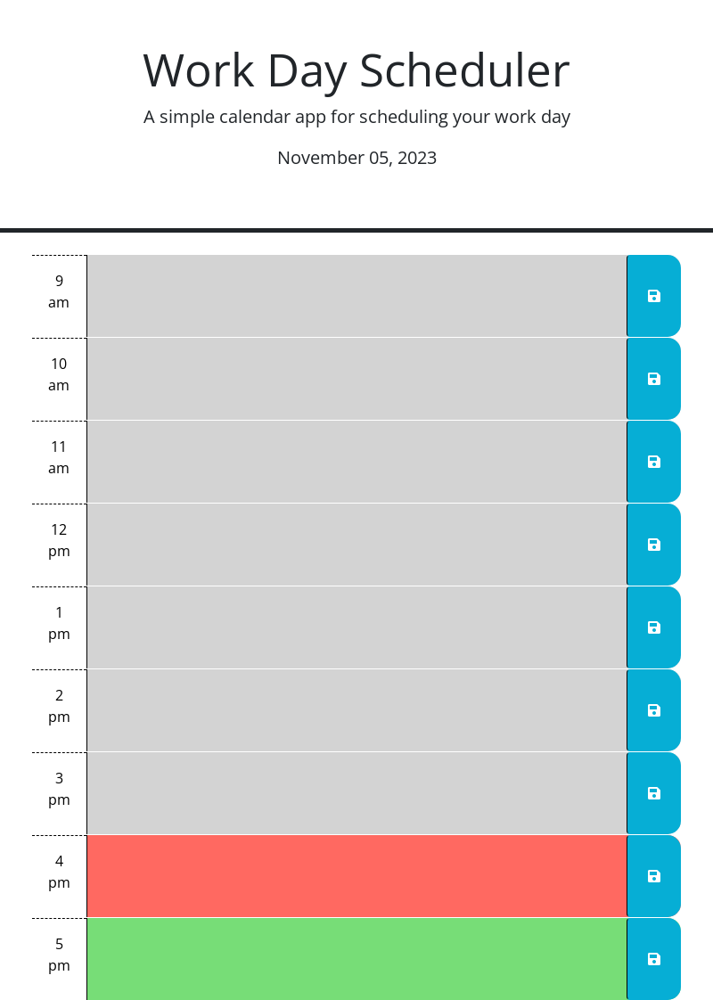

# work_day_scheduler
This is a word day schedule application that is intended to be used to add and save future events throughout a given workday.

## Description
This website was created with the knowlege of Javascript, Web API's, and third party API's taht I have learned through our class work up to this point and in my own research. The larges factors of success for this project in my eyes is my ability to properly use Jquery callers and syntax to correctly shorthand JavaScript, as well as the use of Event Delegation.

## Usage
This planner was ncreated to provide multiple time blocks throughout the day for the user to input events that would re-render when the page is refreshed. The time blocks are color coded to provide greater readability to the user and differentiation between past, present, and future time blocks.

## Conclusion
Durning my creation of this webpage I have learned and sharpened many of my coding skills. These skills include:

* Further reviewed my JavaScript basics to better understand the Jquerey shorthand.

* I gained a greater understanding of web API functionality with my use of Local storage and DOM navigation.

* I achived a more thoughrough understanding of Jquerey functionality and functions to more efficiently achive my coding goals than just using JavaScript.

* I now have a better understanding of dayjs functionality and how it can be used in time specific applications such as this.

## Screenshot

## Links
https://baldwisj.github.io/work_day_scheduler/